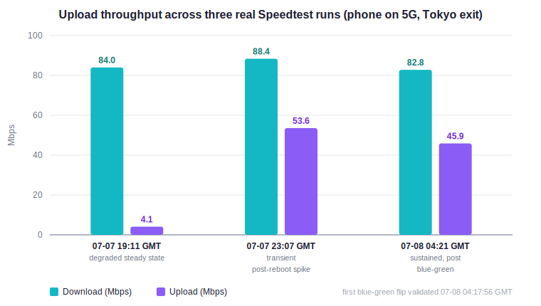

# resilient-multiregion-proxy

A multi-region self-hosted proxy deployment: three servers across two countries, each fronted by a zero-downtime blue-green TCP passthrough, plus a cross-region relay chain and a small Python control-plane CLI. This repo documents the architecture, the engineering decisions behind it, and the tooling — with all server addresses, keys, and client identifiers replaced by placeholders. It is a sanitized companion to a real deployment I operate, published as evidence of the systems/network engineering work referenced in my grad-school application materials.

**Author:** Y.J. Xu · [github.com/ethan0502](https://github.com/ethan0502)

---

## What this is

A self-hosted, censorship-resistant proxy service, deployed independently across three servers (two countries, three hosting providers), each with:

- A **TCP passthrough front door** (nginx `stream` module or HAProxy, depending on what the host's package repos actually support) that never terminates TLS — the proxy's camouflage depends on the origin server's real TLS certificate being presented unmodified.
- A **blue-green pair of backend server processes** behind that front door, refreshed on a schedule with a health-gated cutover, so the long-lived server process is periodically recycled without ever dropping the public listener.
- Camouflage tuned against deep-packet-inspection (DPI) and active-probe detection: standard port 443, a real CDN's TLS server name (SNI), a traffic-shaping flow mode so the encrypted payload is byte-indistinguishable from ordinary TLS, high-entropy handshake short-IDs, and connection logging disabled.

A fourth component chains two of the servers together — a client connects to the server with the best network path, which re-encapsulates the connection to a second server's egress, letting the client keep a specific exit IP without eating that server's own poor upstream peering.

None of the real IPs, cryptographic keys, client identifiers, or handshake short-IDs from the live deployment are in this repo. Every config example uses placeholder values — see [Security notes](#security-notes--what-was-redacted).

## Why this exists

This started as personal infrastructure (get around a censoring network, at first for myself and then for family/friends) and turned into an ongoing systems-engineering exercise: multi-host state tracking, protocol-level fingerprint reduction, an actual production incident with a real root cause, and a zero-downtime deployment mechanism built because a naive "restart the server" approach was measurably degrading upload throughput over time.

## Architecture

```
                         Client (proxy client app)
                                     |
                  camouflaged TLS proxy protocol over TCP
                                     |
           +-------------------------+-------------------------+
           |                         |                         |
           v                         v                         v
+---------------------+   +---------------------+   +---------------------+
|    Node A - Tokyo   |   |  Node B - Malaysia  |   |    Node C - Japan   |
| TCP passthrough :443|   | TCP passthrough :443|   | TCP passthrough :443|
|(container, host net)|   | (HAProxy front door)|   | (container, systemd)|
|                     |   |                     |   |                     |
|+--------+ +--------+|   |+--------+ +--------+|   |+--------+ +--------+|
|| :1443  | | :2443  ||   || :1443  | | :2443  ||   || :1443  | | :2443  ||
|| active | | drain  ||   || active | | drain  ||   || active | | drain  ||
|+--------+ +--------+|   |+--------+ +--------+|   |+--------+ +--------+|
+---------------------+   +---------------------+   +---------------------+
           |                         |                         |
           +-------------------------+-------------------------+
                                     |
              daily cron flip (04:30 local): restart standby,
            liveness-probe it, only then swap the active symlink
                                     |
                                     v
              +----------------------------------------------+
              |         Optional: cross-region relay         |
              |      Node C entry -> re-encapsulate ->       |
              |      Node B egress (raw TCP fast path,       |
              |         dedicated relay-only client)         |
              +----------------------------------------------+
```

Each node is generated from the **same config template** via a small backend generator that produces two byte-identical backends differing only in listen port — so the cryptographic keys, client identifiers, and handshake short-IDs can never drift between the active and standby backend.

### Why three different front-door technologies for three nodes

Node A and Node C could both run nginx with its `stream` (TCP passthrough) module. Node B is a control-panel-managed (Plesk) box whose bundled nginx build has no compatible stream module available in its enabled repos, and installing a parallel nginx would fight the panel's own management of the box — so Node B uses HAProxy for the identical TCP-passthrough blue-green pattern instead. Recognizing *when a host's constraints mean the "consistent" solution is wrong* was as much a part of this project as the design itself.

## Highlights

### 1. DPI-evasion fingerprint hardening (before → after)

The original deployment ran on a non-standard port with a nearly brute-forceable handshake short-ID and no traffic-shape camouflage. It was hardened in a single measured pass:

| Parameter | Before | After | Why it matters |
|---|---|---|---|
| Listening port | `8443` | `443` | Removes the "non-standard HTTPS port" signal that flags a host for deeper DPI |
| SNI / borrowed cert | a well-known camouflage target | a mainstream CDN domain, TLS 1.3 | Avoids client-side cert warnings, blends into ordinary CDN traffic |
| Traffic-shaping flow | *(none)* | enabled | Encrypted payload byte-pattern becomes indistinguishable from real TLS |
| Handshake short-ID entropy | 1 value, 2 hex chars | 5 values, 8 bytes each | A 256-attempt brute force becomes a 5×2⁶⁴ one |
| Access logging | enabled | disabled | No connection record survives if the host is ever seized/imaged |
| Runtime isolation | single systemd process | container/process pinned to an image digest | Rollback is "start the old process again," not "rebuild from scratch" |

The rollout kept the old listener alive during the transition, migrated client profiles in place, and preserved the previous runtime as a cold rollback path rather than deleting it — see [`docs/upgrade-log.md`](docs/upgrade-log.md) for the full before/after diagrams and settings table.

### 2. Zero-downtime blue-green refresh, adapted to two different TCP front doors

Long-lived server processes accumulated enough session state that upload throughput measurably degraded over time; a naive periodic restart would drop every live session at once. This was confirmed reproducible before building anything: a bare restart of the process, no config changes, reliably brought upload back to the node's tuned baseline — that single repeatable observation is what justified building blue-green instead of just living with the degradation or eating the client-visible disruption of a naive restart. The fix: two backend processes per node behind a TCP-passthrough front door, one `active`, one `backup`/draining, flipped daily by a script that **never flips to an unverified backend** — it restarts only the standby, TLS-probes it for the borrowed certificate, and only then swaps the active symlink and reloads the front door. Established sessions ride out the old worker generation and drain naturally (the server's own idle-connection timeout does the rest); a refresh in steady state drops close to zero live sessions. Full design, the nginx `stream{}` block rationale (timeouts, keepalive, why `worker_shutdown_timeout` must stay unset), the throughput observation, and the rollback plan are in [`docs/blue-green-deployment.md`](docs/blue-green-deployment.md) — the actual flip scripts and front-door configs run in production are in [`deploy/`](deploy/): [nginx](deploy/nginx/) + [Docker](deploy/xray443-flip-nginx-docker.sh) on Node A, [nginx](deploy/nginx/) + [podman](deploy/xray443-flip-nginx-podman.sh) on Node C, [HAProxy](deploy/haproxy/) + [its own flip script](deploy/xray443-flip-haproxy.sh) on Node B, and the [backend generator](deploy/backends/regen-backends.py) that keeps both blue and green backends byte-identical. Real throughput data spanning this design's cutover is in the [Benchmarks](#benchmarks) section below.

### 3. A real production incident and its root cause

One node's blue-green front door quietly failed after a few days, and the "obvious" explanation (config drift) turned out to be wrong. The actual chain: the kernel OOM killer selected the proxy process under memory pressure → the host's legacy web server, configured to auto-restart on failure, immediately re-bound the now-free port → the proxy's own restart attempts then failed with "address already in use" and gave up after a few tries → separately, the host's control-panel logrotate hook was independently capable of reviving that same web server even when its systemd unit was disabled. The fix that actually stuck was masking the web server's unit outright (a hard block that a config-management panel's internal restart calls can't override), not just stopping it. Full RCA narrative in [`docs/architecture.md`](docs/architecture.md).

### 4. Cross-region relay chaining for a specific exit IP with better throughput

One node's own peering path from the client's network is poor (a real inter-carrier congestion issue, confirmed by isolating the proxy stack entirely and comparing raw `scp` throughput over the same path), even though that node's own uplink bandwidth is fine. A second node happens to have much better peering *to* the first node. Rather than accept the slow path, traffic is relayed: client → better-peered node (dedicated relay-only inbound, its own camouflaged-handshake keypair) → re-encapsulated as a raw TCP client of the target node's egress-only fast path → target node's IP. The relay client is a separate, independently revocable credential from normal end-user clients. Root-caused with `traceroute` and paired raw-socket throughput tests before building the relay, not assumed. The relay entry's actual config template, systemd unit, and the relay-aware backend generator (which gives each blue-green backend a second, plain-TLS-free inbound just for the relay's server-to-server leg) are in [`deploy/relay/`](deploy/relay/), [`deploy/systemd/xray-relay.service`](deploy/systemd/xray-relay.service), and [`deploy/backends/regen-backends-with-relay.py`](deploy/backends/regen-backends-with-relay.py). Measured relay-vs-direct throughput for this decision is in the [Benchmarks](#benchmarks) section below.

### 5. A small, safe Python control-plane CLI

[`vpn_user_manager.py`](vpn_user_manager.py) — SSHes to a node, adds/lists/removes clients with atomic config writes (`jq` + backup + validate + restart + verify, never a bare overwrite), derives the client-facing public key from the private key server-side, and prints both a scannable QR code and a raw share link. Bootstraps its own throwaway virtualenv for the `qrcode` dependency if it isn't already installed, so the script has zero setup steps beyond Python + SSH access.

[`update_profile.py`](update_profile.py) — reads a small per-client policy file (allow/block domain and IP lists) and compiles it into per-client routing rules scoped via the `user` field, so individual clients can be sandboxed to specific destinations without affecting anyone else.

## Benchmarks

Real repeated-run speed tests from a client on the operator's own LAN, one node at a time, 3 runs each (8 MiB down + 8 MiB up per run). Collected with the blue-green front door already live on every node — a steady-state snapshot, not a synthetic before/after.

| Node | Exit region | Download (MiB/s) | Upload (MiB/s) | Latency (ms) |
|---|---|---|---|---|
| JP direct | Japan | 3.11 | 0.91 | 548 |
| Tokyo primary | Tokyo | 2.67 | 1.16 | 1182 |
| Tokyo (alt client) | Tokyo | 2.44 | 1.06 | 1144 |
| **JP relay → Malaysia** | **Malaysia (via Japan relay)** | **1.60** | **0.81** | 1581 |
| Malaysia (client A) | Malaysia | 0.87 | 0.38 | 1078 |
| Malaysia (client B) | Malaysia | 0.70 | 0.28 | 995 |


The headline result is the **relay row**: routing Malaysia-exit traffic *through* the better-peered Japan node roughly doubles direct-Malaysia download throughput (1.60 vs 0.70–0.87 MiB/s) while keeping the Malaysia exit IP the client actually needs — the measured payoff of the cross-region relay chaining described in Highlight #4. It's a real improvement, not a full fix: the client's own international path to the relay entry point remains the dominant bottleneck. Full methodology, per-node variance, the raw data files, and the caveats (upload endpoint noise, harness latency overhead, small sample size) are in [`benchmarks/`](benchmarks/README.md).

### Upload throughput around the blue-green cutover

A separate, real-world data point that shows *why* the blue-green refresh exists: three Ookla Speedtest runs from a phone on 5G through the Tokyo node's exit, spanning the exact hour the blue-green front door went live. Timestamps are cross-checked against the node's own deployment artifacts — the front-door config files were written at `2026-07-08 04:14–04:15 GMT`, and the flip log records the first successful blue-green flip completing at `04:17:56 GMT`.



| Time (GMT) | Download | Upload | State |
|---|---|---|---|
| 2026-07-07 19:11 | 84.0 Mbps | **4.1 Mbps** (~0.5 MB/s) | degraded steady state, pre-deploy |
| 2026-07-07 23:07 | 88.4 Mbps | 53.6 Mbps (~6.7 MB/s) | transient spike right after a full server reboot — **not sustainable**, decayed back to <1 MB/s soon after |
| 2026-07-08 04:21 | 82.8 Mbps | 45.9 Mbps (~5.7 MB/s) | **sustained**, +3 min after the first blue-green flip |

Download stayed in the same 83–88 Mbps band across all three runs — this was specifically an upload problem, not a general connection problem. The story the three points tell: **sustained** upload sat below 1 MB/s (row 1). A full server reboot could transiently restore it to ~6.7 MB/s (row 2), but that was a short-lived spike that decayed straight back under 1 MB/s as the freshly-started process aged — exactly the degradation-over-time mechanism documented in [`docs/blue-green-deployment.md`](docs/blue-green-deployment.md#motivation). Blue-green turns that unsustainable "reboot briefly fixes it" behaviour into a **guaranteed daily steady-state**: it performs the equivalent process refresh every day with zero downtime, so upload holds around 5–7 MB/s (row 3) instead of sliding back under 1 MB/s between manual reboots.

## Repository layout

```
.
├── README.md
├── LICENSE
├── vpn_user_manager.py            # add/list/remove clients over SSH
├── update_profile.py              # compile per-client routing policy into the server config
├── convert_to_clash.py            # client rule-list -> Clash rules: YAML
├── xray_docker_config.example.json  # source-of-truth server config template (placeholder keys/IDs)
├── docs/
│   ├── architecture.md            # per-node runtime inventory + the OOM/logrotate RCA
│   ├── upgrade-log.md             # the DPI-hardening before/after, with diagrams
│   ├── blue-green-deployment.md   # the zero-downtime refresh design in full
│   └── client-setup-guide.md      # the plain-language guide given to non-technical users
├── deploy/                        # the actual artifacts each node runs, sanitized in place
│   ├── nginx/                     # stream front-door config (Node A / Node C)
│   ├── haproxy/                   # TCP front-door config (Node B)
│   ├── systemd/                   # podman-wrapped backend + relay unit templates
│   ├── backends/                  # config generators (plain + relay-aware variants)
│   ├── relay/                     # relay entry node's server config template
│   ├── xray443-flip-nginx-docker.sh   # daily flip, Node A (Docker)
│   ├── xray443-flip-nginx-podman.sh   # daily flip, Node C (podman)
│   └── xray443-flip-haproxy.sh        # daily flip, Node B (HAProxy)
└── benchmarks/                    # real speed-test data + methodology (see its README)
    ├── README.md                  # method, results table, per-node analysis, caveats
    ├── summary.csv / summary.json
    └── avg-bar.svg / run-variability.svg / upload-recovery.svg
```

## Quickstart (adapting this to your own deployment)

This repo is a template, not a turnkey installer — proxy deployments like this are inherently host-specific (which front-door technology is even installable depends on what your provider's control panel already owns). To stand up something similar:

1. Generate a fresh camouflaged-handshake keypair and a fresh set of high-entropy handshake short-IDs — never reuse the placeholder values in [`xray_docker_config.example.json`](xray_docker_config.example.json) or anything under [`deploy/`](deploy/).
2. Pick an SNI you camouflage as: a mainstream site that serves TLS 1.3 and that the proxy engine doesn't warn about.
3. Deploy the config with whatever TCP-passthrough front door your host actually supports — [`deploy/nginx/`](deploy/nginx/) + [`deploy/xray443-flip-nginx-docker.sh`](deploy/xray443-flip-nginx-docker.sh)/[`-podman.sh`](deploy/xray443-flip-nginx-podman.sh), or [`deploy/haproxy/`](deploy/haproxy/) + [`deploy/xray443-flip-haproxy.sh`](deploy/xray443-flip-haproxy.sh) if nginx's stream module isn't available. Design rationale for every setting is in [`docs/blue-green-deployment.md`](docs/blue-green-deployment.md).
4. Point `vpn_user_manager.py --host <your-host> --user <your-ssh-user>` at it to manage clients.

## Security notes — what was redacted

This is a sanitized copy of a real, currently-operated deployment. Every server IP, cryptographic private/public key, client identifier, handshake short-ID, and non-standard SSH port from the live configuration has been replaced with an obviously-fake placeholder (`203.0.113.x` documentation-range addresses, `<...>` tokens, or clearly-labeled example values) — none of the values in this repo will connect to anything. Generated client-profile artifacts, a QR code that encoded a live credential, and a large third-party ad-block rule list were excluded entirely rather than redacted in place.

## License

MIT — see [LICENSE](LICENSE).
