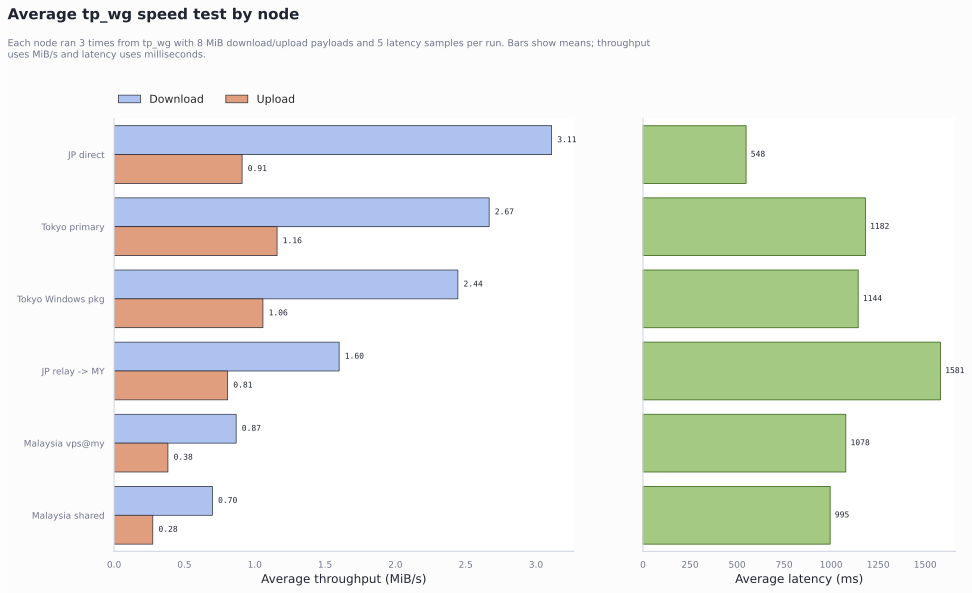

# Benchmarks

Real speed-test data backing the throughput claims in [`docs/architecture.md`](architecture.md) ("Cross-region relay chaining"). Server IPs, client UUIDs, and the tester's local machine details have been stripped from the raw output; the numbers themselves are unmodified.

## Method

- Client vantage point: a Windows host on the operator's own LAN.
- Test runner: a temporary no-TUN Mihomo profile, run once per node, torn down afterward — nothing measured here rides the operator's normal daily VPN session.
- Nodes tested: Tokyo (two different client profiles), Malaysia (two different client identities), Japan direct, and the Japan-entry → Malaysia-egress relay chain.
- 3 repeated runs per node, 8 MiB download + 8 MiB upload per run, 5 latency samples per run.
- Download via a CDN speed-test endpoint; upload via a third-party echo endpoint — see the caveat below, upload numbers are noisier than download.

## Results

| Node | Exit region | Download (MiB/s) | Upload (MiB/s) | Latency (ms) | Runs |
|---|---|---|---|---|---|
| JP direct | Japan | 3.11 | 0.91 | 548 | 3/3 |
| Tokyo primary | Tokyo | 2.67 | 1.16 | 1182 | 3/3 |
| Tokyo (alt client) | Tokyo | 2.44 | 1.06 | 1144 | 3/3 |
| JP relay → Malaysia | Malaysia (via Japan relay) | 1.60 | 0.81 | 1581 | 3/3 |
| Malaysia (client A) | Malaysia | 0.87 | 0.38 | 1078 | 3/3 |
| Malaysia (client B) | Malaysia | 0.70 | 0.28 | 995 | 3/3 |

Full machine-readable data: [`summary.csv`](../benchmarks/summary.csv), [`summary.json`](../benchmarks/summary.json). Charts: [`avg-bar.svg`](../benchmarks/avg-bar.svg) (average download/upload/latency per node), [`run-variability.svg`](../benchmarks/run-variability.svg) (run-to-run spread).

## Reading these numbers

This is the actual data that drove the relay-chaining decision described in `docs/architecture.md`: direct Malaysia throughput (0.70–0.87 MiB/s down) is well below Japan-direct (3.11 MiB/s down) despite Malaysia's own uplink being fine in isolation — the gap is inter-carrier peering quality on the path to Malaysia specifically, confirmed separately with raw (non-proxied) transfer tests over the same path. Relaying through Japan (1.60 MiB/s down while still exiting as the Malaysia IP) roughly doubles direct-Malaysia throughput without giving up the Malaysia exit IP the client actually needs — a real, measured improvement, not a full fix, since the client's own path to the relay's entry point is a separate bottleneck the relay doesn't touch.

The two Tokyo rows and two Malaysia rows are the same node tested with two different client identities/profiles in the same run, included to show run-to-run and profile-to-profile variance rather than a single cherry-picked number.

## Known caveats in this data

- **Upload numbers are noisier than download.** The upload target is a third-party echo endpoint, not a CDN; suspiciously similar upload figures across otherwise-different nodes suggest that endpoint itself may be part of what's capped, not pure path bandwidth. Download numbers (via a CDN) are more trustworthy.
- **Latency here includes the no-TUN Mihomo test harness overhead**, not just raw network RTT — treat these as relative-comparison numbers between nodes tested the same way, not absolute network latency.
- Small sample size (3 runs/node) — enough to see the relay-chaining effect clearly (2x+), not enough to treat single-digit-percent differences between nodes as significant.
