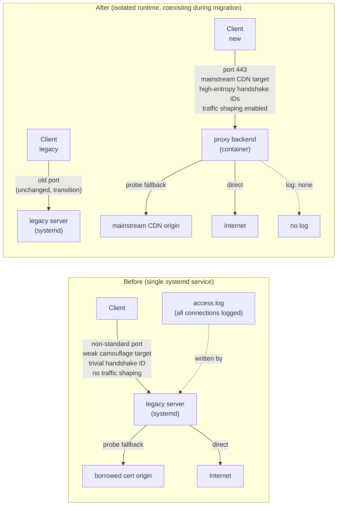
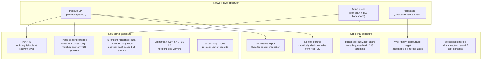
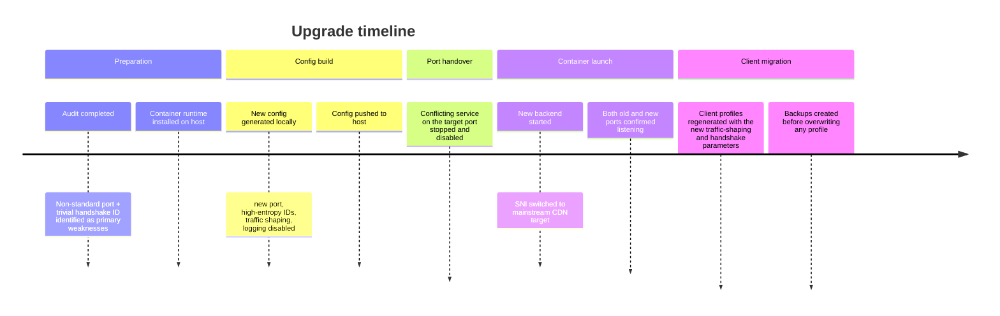

# Traffic-Fingerprint Hardening: Before vs. After

This log documents a single hardening pass applied to reduce the protocol- and traffic-level fingerprint a camouflaged TLS proxy exposes to deep-packet inspection and active probing. All IPs, keys, and identifiers below are placeholders.

## Architecture: before vs. after



## Traffic camouflage: before vs. after



## Settings comparison

| Parameter | Before | After | Impact |
|---|---|---|---|
| Listening port | non-standard | `443` | Removes the non-standard-port signal |
| Camouflage target | a well-known probe target | a mainstream CDN domain, TLS 1.3 | Avoids client-side warnings; blends into ordinary CDN traffic |
| Traffic shaping | *(none)* | enabled | Traffic byte-pattern matches ordinary TLS |
| Handshake IDs | 1 value, 2 hex chars | 5 values, 8 bytes each | Brute-force becomes infeasible |
| Access log | enabled | `none` | No connection record survives host seizure/imaging |
| Runtime | bare systemd process | pinned-image container, isolated | Rollback is "start the old process again" |
| Old port | active | kept alive during transition | Existing clients uninterrupted |

## Deployment sequence



## Detection-surface summary

```mermaid
radar
    title Detection risk (lower = better)
    x-axis ["Port fingerprint", "Handshake-ID brute-force", "Traffic pattern", "SNI reputation", "Log exposure", "Active probe"]
    Before [70, 95, 60, 30, 80, 20]
    After  [5,  2,  5,  10, 0,  20]
```

## Protocol-specific client link format (literal compatibility example)

```
vless://<CLIENT_UUID>@<HOST>:443
  ?encryption=none
  &security=reality
  &sni=<MAINSTREAM_CDN_SNI>
  &fp=chrome
  &pbk=<REALITY_PUBLIC_KEY>
  &sid=<SHORT_ID>
  &type=tcp
  &flow=xtls-rprx-vision
  #<name>
```

The machine-readable link necessarily keeps the implementation's literal field names. The meaningful changes were: traffic shaping enabled, port switched to `443`, camouflage target switched to a mainstream CDN, and the handshake identifier changed from a 2-character value to one of five 8-byte random values.

## Remaining work at the time of this pass

- Confirm the new port works from at least one real client before retiring the old one
- Once all clients have migrated, remove the legacy inbound from the old runtime's config entirely
- Re-evaluate whether the old runtime should keep running at all, or be fully decommissioned
